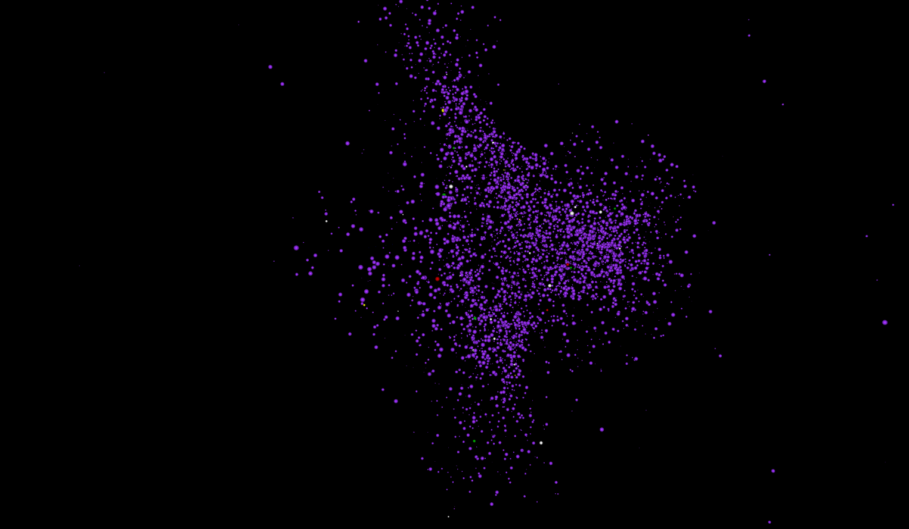

# GalaxySimulation
This is a Barnes-Hut N-body simulation under the JavaFX framework. 
This simulation can run smoothly with 5000 particles. 
Press P to pause and unpause. Use left mouse button to move, scroll to zoom, and right mouse button to rotate.

To run it, use JavaFX 8 

